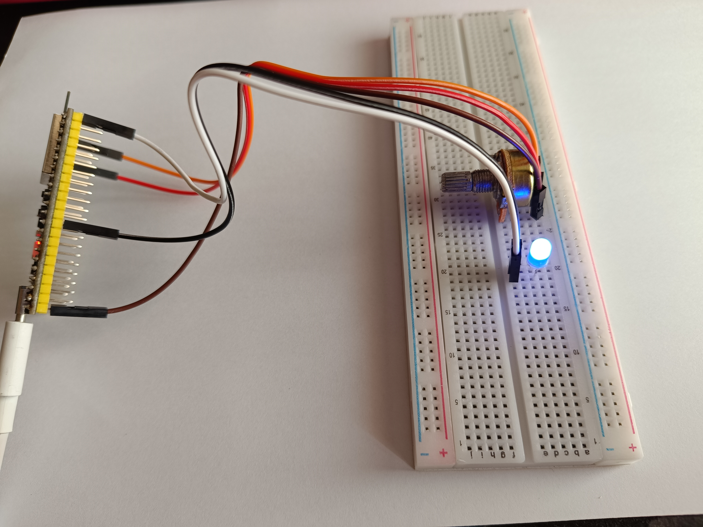
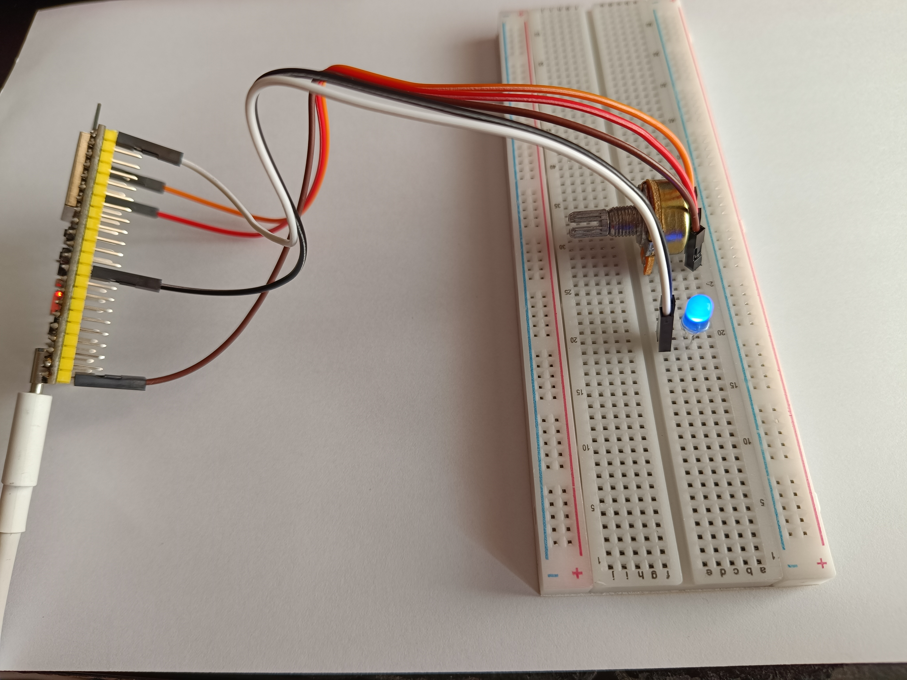
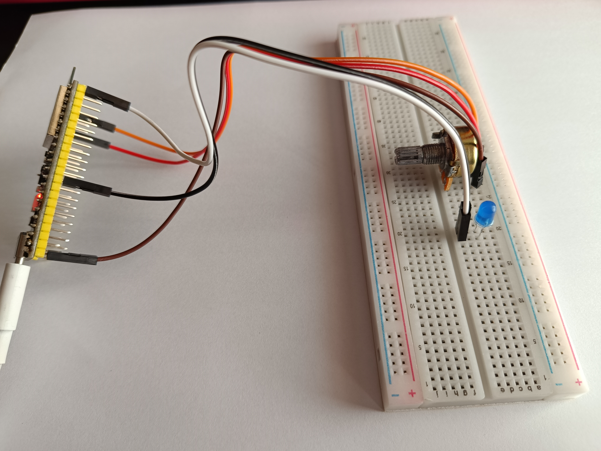

# Practica 1 (mejora de nota): convertidor A/D
## Objetivo: 
- Leer el valor de un convertidor A/D de entrada ; sacarlo por el puerto serie y sacar el mismo valor por
otro pin D/A.
## Materiales: 
- ESP32-S3
- Potenciometro 10K
- Led azul
## Procedimiento: 
**Codigo:**
```cpp
    #include <Arduino.h>

    const int pwmOutputPin = 35; // pin de salida (LED)
    const int portPin = 4; // pin de entrada (POTENCIOMETRO)

    int portValue = 0; // potencia medida 

    void setup ()
    {
    Serial.begin(115200); 
    pinMode(pwmOutputPin, OUTPUT); //  Inicializar la salida del LED 
    delay(1000);
    }

    void loop ()
    {
    portValue = analogRead(portPin); // lee el nivel de voltage 
    Serial.println(portValue);
    analogWrite(pwmOutputPin, portValue); // regula la intensidad del led segun el nivel de voltage 
    delay(500);
    }
```
**Descripcion:**<br>
Primero se declaran las variables que van a sus correspondientes pines, uno de entrada hacia un convertidor A/D, y el otro de salida a un pin D/A. Se ha optado por un potenciometro y un LED. <br>
Una vez conectados los pines, se lee la informacion del pin de entrada y se ve reflejada tanto el puerto serie como en el pin de salida. <br><br>
La potencia puede variar entre 0 y 4095, donde 0 es el nivel mas bajo posible (0V) y 4095 es el nivel mas alto (3.3V).

**Representación:**<br>


- Nivel maximo, 4095.
```
    // PUERTO SERIE: 
    4095
    4095
    4095
    4095
    4095
```


- Nivel intermedio (mientras disminuia el nivel de potencia):

```
    //PUERTO SERIE: 
    2021
    1765
    875
    789
    781
    860
    967
```


- Nivel minimo, 0:

```
    //PUERTO SERIE: 
    0
    0
    0
    0
    0
```


## Conclusiones: 
En este programa podemos regular la potencia de la luz del led a partir del potenciometro. El potenciometro es el convertidor A/D, que según la potencia que le des, el otro pin D/A (en este caso el LED) se iluminará más o menos. 